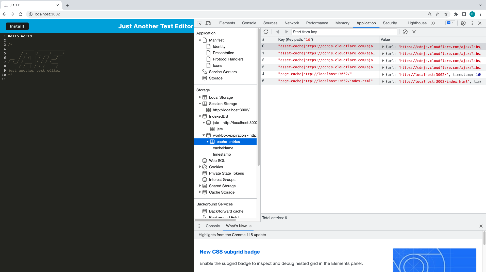

# C19JATEChallenge


GitHub URL: https://github.com/peterwonghg/C19JATEChallenge.git

## Table of Contents:
### - [Description](#description)
### - [Installation](#installation)
### - [Usage](#usage)
### - [License](#license)
### - [Contributing](#contributing)
### - [Questions](#questions)
<br><br>

## Description

```md
AS A developer
I WANT to create notes or code snippets with or without an internet connection
SO THAT I can reliably retrieve them for later use
```

The web text editor application enables users to create notes or code snippets both online and offline. Using the integrated service worker and Cache API's, the application remains fully functional even without an active internet connection, ensuring reliable access to saved content at a later time. Additionally, the application allows users to access visited pages while offline.


## Installation
Install the Dev folder and run index.js in the integrated terminal

1. Download or clone repository from GitHub URL: https://github.com/peterwonghg/C19JATEChallenge.git
2. Run npm i
3. Run npm run start:dev
4. On the browser Run localhost:3003
5. Click Install button to Install and use offline

## Usage
```md
GIVEN a text editor web application
WHEN I open my application in my editor
THEN I should see a client server folder structure
```


```md
WHEN I run `npm run start:dev` from the root directory
THEN I find that my application should start up the backend and serve the client
WHEN I run the text editor application from my terminal
THEN I find that my JavaScript files have been bundled using webpack
WHEN I run my webpack plugins
THEN I find that I have a generated HTML file, service worker, and a manifest file
```


```md
WHEN I use next-gen JavaScript in my application
THEN I find that the text editor still functions in the browser without errors
WHEN I open the text editor
THEN I find that IndexedDB has immediately created a database storage
WHEN I enter content and subsequently click off of the DOM window
THEN I find that the content in the text editor has been saved with IndexedDB
WHEN I reopen the text editor after closing it
THEN I find that the content in the text editor has been retrieved from our IndexedDB
```


```md
WHEN I click on the Install button
THEN I download my web application as an icon on my desktop
```


```md
WHEN I load my web application
THEN I should have a registered service worker using workbox
WHEN I register a service worker
THEN I should have my static assets pre cached upon loading along with subsequent pages and static assets
```



```md
WHEN I deploy to Heroku
THEN I should have proper build scripts for a webpack application
```


## License
- MIT

## Contributing
Thank you for investing your time in contributing to JATE project!<br><br>
In this guide you will get an overview of the contribution workflow from creating a pull request, reviewing and merging the pull request.<br><br>
<b>Making the changes locally</b><br>
1. Fork the repository<br>
2. Install or update Node.js 8.2.4<br>
3. Create a working branch and start with your changes!<br><br>
<b>Commit your update</b><br>
Commit the changes once you are happy with them.  Don't forget to self-review to speed up the review process.<br><br>
<b>Pull Request</b><br>
When you are finished with the changes, create a pull request<br><br>
<b>Merging your Pull Request</b><br>
1. Our team will review your Pull Request.<br>
2. We may ask for changes to be made before your Pull Request can be merged.<br>
3. You can apply suggested changes directly through the UI.  You can make any other changes on your fork, then commit them on your branch.<br>
4. As you update your PR and apply changes, mark each conversation as resolved.<br>
5. You can then merge your contributions.<br><br>
Thank you for your contribution.<br><br>

## Questions
If you have any questions, please contact me:
- GitHub: [peterwonghg](https://github.com/peterwonghg)
- Email: peterwonghg@gmail.com
<br><br>
